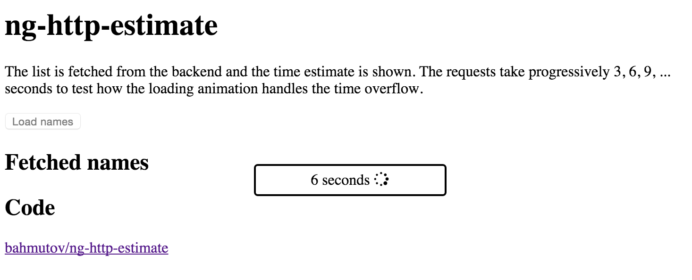

# ng-http-estimate

> Automatic $http request time estimates

[Demo](http://glebbahmutov.com/ng-http-estimate/)

    npm|bower install ng-http-estimate

Include 'ng-http-estimate.js' script in your page and add dependency on 'http-estimate'

    angular.module('app', ['http-estimate']);

Place the loading element into the body, you can also style it

    <body>
        <http-estimate></http-estimate>
        ...
    </body>

The element will appear automatically on HTML requests and will show estimated remaining
time (if previously computed) or "loading ..." message.



## Features

* Measurements are saved in the local storage.
* You can pass your own estimator function via config provider. The function can
use built-in estimator and should return the wait time in milliseconds. For example:

```js
.config(function (httpEstimateProvider) {
  httpEstimateProvider.set({
    estimator: function (cacheEstimator, url) {
      console.log('need to estimate how long get request to', url, 'would take');
      var estimate = cacheEstimator(url);
      console.log('built-in cache estimator says', estimate);
      console.log('will trust it');
      return estimate;
    }
  });
})
```

## Small print

Author: Gleb Bahmutov &copy; 2015

* [@bahmutov](https://twitter.com/bahmutov)
* [glebbahmutov.com](http://glebbahmutov.com)
* [blog](http://glebbahmutov.com/blog)

License: MIT - do anything with the code, but don't blame me if it does not work.

Spread the word: tweet, star on github, etc.

Support: if you find any problems with this module, email / tweet /
[open issue](https://github.com/bahmutov/ng-http-esimate/issues) on Github
